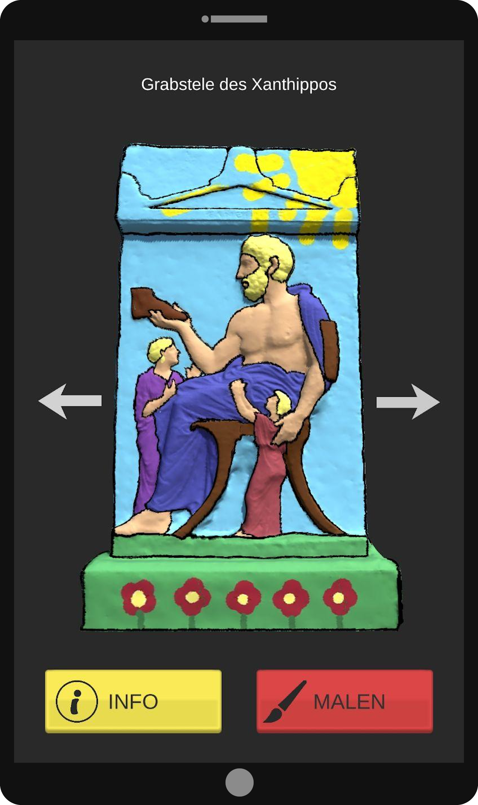
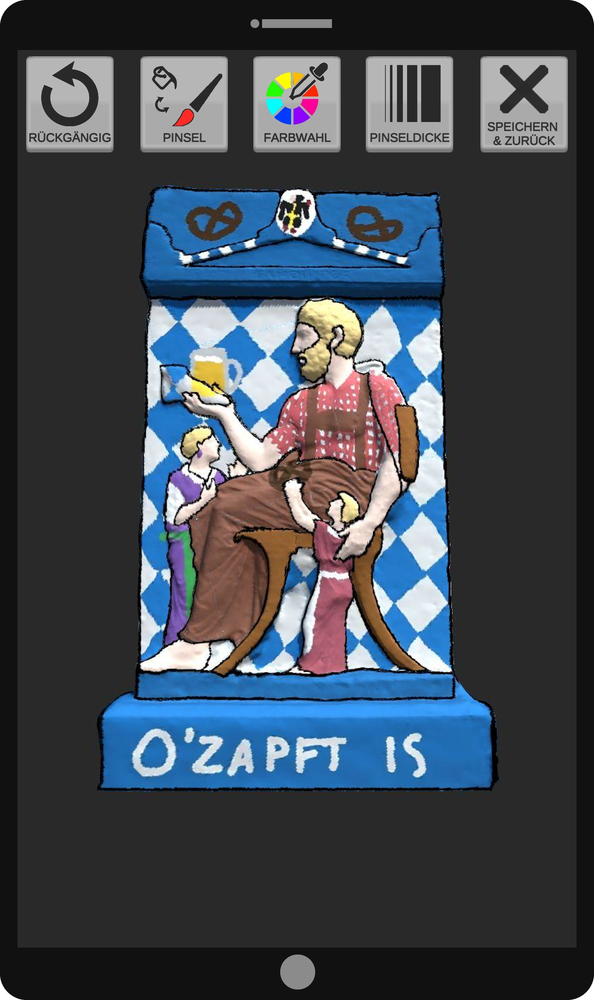
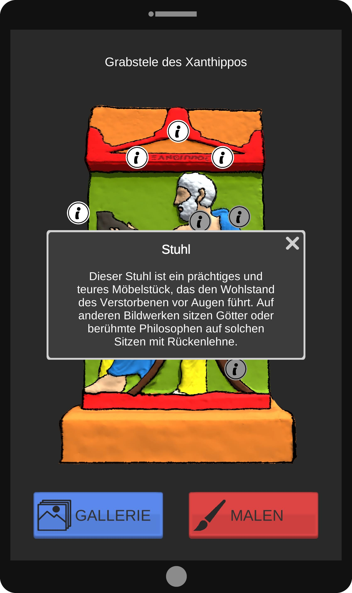
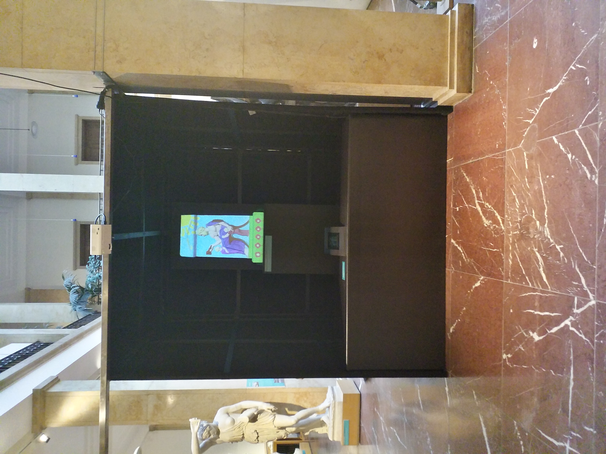
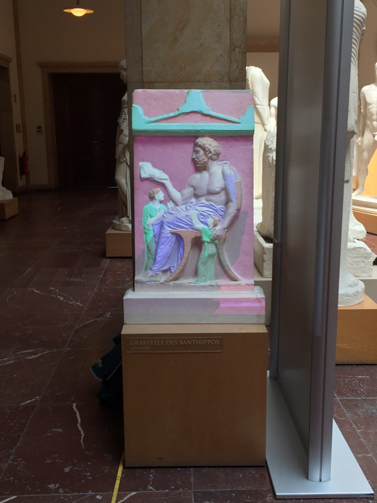

# Projective AR in a Museum
## Development of an Interactive Painting Application
In cooperation with the "Museum für Abgüsse Klassischer Bildwerke" in Munich we developed an application to augment an antique sculpture using Unity3d. The AndroidApp is running on a Tablet and interacts via WIFI with a computer, which is running the ProjectorApp and is connected to a projector. Further information can be found [here](https://wiki.tum.de/display/infar/MP%3A+Using+Projective+Augmented+Reality+in+an+Interactive+Museum+Application).

## Impressions

  
  
  

  
  

